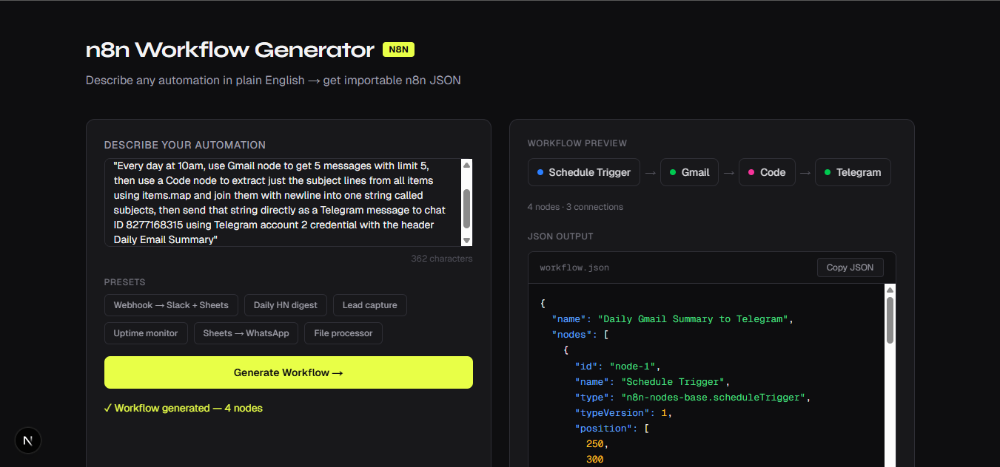
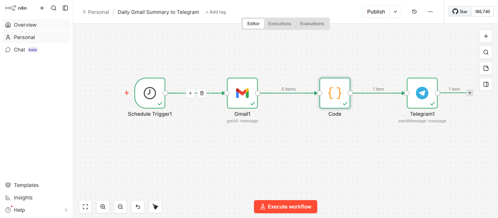

# n8n Workflow Generator

Generate importable **n8n workflow JSON** from plain English descriptions using Google Gemini AI.

Describe any automation in a single sentence — the app calls Gemini, returns a structured JSON workflow, and lets you copy or download it straight into n8n.

---

## Tech Stack

| Layer | Technology |
|---|---|
| Framework | Next.js 14 (App Router) |
| Language | TypeScript |
| Styling | Tailwind CSS |
| AI | Google Gemini API (`gemini-flash-latest`) |
| SDK | `@google/generative-ai` |

---

## Setup

### 1. Clone the repo

```bash
git clone https://github.com/pun33th45/n8n-workflow-generator.git
cd n8n-workflow-generator
```

### 2. Install dependencies

```bash
npm install
```

### 3. Add your Gemini API key

Create a `.env.local` file in the project root:

```bash
GEMINI_API_KEY=your_key_here
```

Get a free key at [https://aistudio.google.com/app/apikey](https://aistudio.google.com/app/apikey).

### 4. Start the dev server

```bash
npm run dev
```

Open [http://localhost:3000](http://localhost:3000).

---

## Usage

1. **Describe your automation** in plain English in the textarea, e.g.:
   > *"Every morning at 9am, fetch the top 5 Hacker News posts and send them to Telegram"*

2. **Use a preset** — click any of the 6 preset buttons to auto-fill a common workflow pattern.

3. **Click Generate Workflow →** — Gemini builds the JSON and the app validates it.

4. **Review the output** — the node preview strip shows each node and its connections. The JSON viewer shows syntax-highlighted output.

5. **Copy or Download** — use the Copy JSON button or Download JSON button to get the file.

6. **Import into n8n** — in n8n, go to **Add Workflow → Import from JSON**, paste or upload the file, add your credentials to each node, and run.

---

## Project Structure

```
├── app/
│   ├── page.tsx                 # Main UI
│   ├── layout.tsx               # Root layout + fonts
│   └── api/generate/route.ts   # POST /api/generate → Gemini
├── components/
│   ├── WorkflowForm.tsx         # Textarea + presets + button
│   ├── JsonViewer.tsx           # Syntax-highlighted JSON output
│   └── NodePreview.tsx          # Node pill strip
├── lib/
│   ├── prompt.ts                # System prompt for Gemini
│   └── n8n-types.ts             # TypeScript types for n8n schema
└── .env.local                   # Your API key (not committed)
```

---

## Screenshots

### Workflow Generator UI


### Generated Workflow in n8n


### Telegram Output


---

## License

MIT
